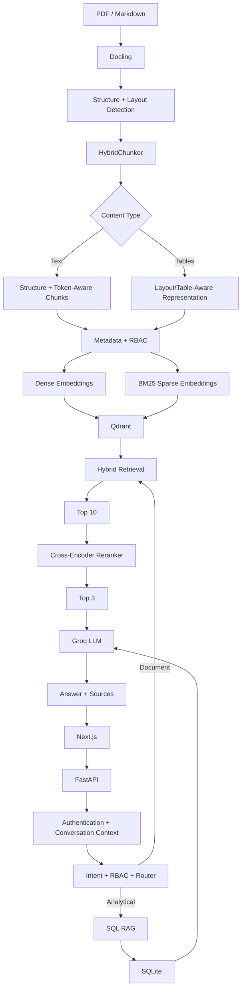

# 🏥 MediBot — Role-Aware Hybrid RAG Healthcare Assistant

MediBot is an advanced Retrieval-Augmented Generation (RAG) assistant built for the fictional **MediAssist Health Network**.

It combines Docling document parsing, structure-aware and layout-aware chunking, hybrid dense + BM25 retrieval, Qdrant RBAC filtering, cross-encoder reranking, SQL RAG, conversational context, FastAPI, and a Next.js frontend.

## 🚀 Project Status

| Component | Status |
|---|---|
| Docling document  | ✅ Complete |
| Structure/hierarchical-aware chunking | ✅ Complete |
| Token-aware chunking | ✅ Complete |
| Layout-aware table handling | ✅ Complete |
| RBAC metadata filtering in Qdrant | ✅ Complete |
| Dense + BM25 hybrid retrieval | ✅ Complete |
| Cross-encoder reranking | ✅ Complete |
| SQL RAG | ✅ Complete |
| FastAPI backend | ✅ Complete |
| Conversational follow-ups | ✅ Complete |
| Next.js frontend | ✅ Complete |
| Source citations | ✅ Complete |

## 🏗️ Architecture



## 🧩 Core Components

### 1. Document  & Chunking
Docling parses PDF and Markdown sources while preserving document structure. `HybridChunker` provides structure-aware chunking followed by token-aware size control. Tables receive layout-aware handling so related values remain together rather than being split across arbitrary text boundaries.

Each chunk stores:
- `source_document`
- `collection`
- `access_roles`
- `section_title`
- `chunk_type` (`text`, `table`, `heading`, or `code`)

### 2. Hybrid RAG
Dense embeddings use `sentence-transformers/all-MiniLM-L6-v2`. Sparse retrieval uses `Qdrant/bm25` through FastEmbedSparse. Qdrant uses `RetrievalMode.HYBRID` so semantic and lexical representations are queried together.

### 3. Cross-Encoder Reranking
Hybrid retrieval returns the top 10 candidates. `cross-encoder/ms-marco-MiniLM-L-6-v2` reranks them and only the top 3 chunks are supplied to the LLM.

### 4. Role-Based Access Control

| Collection | Allowed Roles |
|---|---|
| General | Doctor, Nurse, Billing Executive, Technician, Admin |
| Clinical | Doctor, Admin |
| Nursing | Nurse, Doctor, Admin |
| Billing | Billing Executive, Admin |
| Equipment | Technician, Admin |

RBAC is enforced in the Qdrant query through chunk metadata. MediBot also performs collection-intent checks to provide explicit access-denied responses.

### 5. SQL RAG
Structured analytical questions use SQLite (`mediassist.db`) with the `claims` and `maintenance_tickets` tables. The flow is schema inspection → LLM SQL generation → SQL cleaning/validation → SQLite execution → natural-language answer. Only read-only `SELECT` statements are allowed.

### 6. Conversational Context
Recent chat history is used to rewrite ambiguous follow-ups into standalone questions before RBAC, routing, retrieval, reranking, and generation.

### 7. FastAPI Backend
Endpoints:
- `POST /login`
- `POST /chat`
- `GET /collections/{role}`
- `GET /health`

### 8. Next.js Frontend
The UI provides login, role display, chat, follow-up questions, RBAC refusal messages, grounded answers, source citations, API status, and logout/session handling.

## 🔐 Demo Accounts

| Username | Password | Role |
|---|---|---|
| `dr.mehta` | `doctor` | Doctor |
| `nurse.priya` | `nurse` | Nurse |
| `billing.ravi` | `billing` | Billing Executive |
| `tech.anand` | `technician` | Technician |
| `admin.sys` | `admin` | Admin |

## 🛠️ Technology Stack

| Area | Technology |
|---|---|
| Parsing | Docling |
| Chunking | Docling HybridChunker |
| Tables | Layout/Table-Aware Processing |
| Dense Embeddings | all-MiniLM-L6-v2 |
| Sparse Retrieval | BM25 / FastEmbedSparse |
| Vector DB | Qdrant |
| Reranking | ms-marco-MiniLM-L-6-v2 |
| LLM | Groq-hosted LLM |
| SQL RAG | LangChain + SQLite |
| Backend | FastAPI |
| Frontend | Next.js |
| Environment | Python + uv / WSL |

## 📂 Project Structure

```text
Medibot/
├── backend/
│   ├── __init__.py
│   ├── app.py
│   ├── ingestion_5_layout_aware.py
│   ├── retreival_rerank.py
│   └── sql_rag.py
├── mediassist_data/
│   ├── general/
│   ├── clinical/
│   ├── nursing/
│   ├── billing/
│   ├── equipment/
│   └── db/
│       └── mediassist.db
├── qdrant_data_hybrid/
├── Frontend/
│   └── medibot-ui/
├── .env
├── pyproject.toml
└── README.md
```

`mediassist_data/db/` contains structured SQLite data and is not ingested into Qdrant.

## ⚙️ Setup

```bash
git clone <YOUR_REPOSITORY_URL>
cd Medibot
uv sync
```

Create `.env`:

```env
GROQ_API_KEY=your_groq_api_key
GROQ_MODEL=your_groq_model
```

Do not commit `.env` or API keys.

### Build the vector index

```bash
uv run python backend/ingestion_5_layout_aware.py
```

### Run FastAPI

```bash
uv run uvicorn backend.app:app
```

Swagger is available at `http://127.0.0.1:8000/docs`.

Because local embedded Qdrant is used, do not run  and FastAPI against the same Qdrant directory simultaneously.

### Run Next.js

```bash
cd Frontend/medibot-ui
npm install
npm run dev
```

Open `http://localhost:3000`.

## 🧪 Example Tests

Billing:
```text
What is the package for Type 2 diabetes without complications?
What is the typical LOS?
Does it require pre-authorisation?
What is the procedure code for hernia repair?
```

Nursing:
```text
What is the site selection order for IV cannula insertion?
What size should be used for a patient under 5 kg?
```

SQL RAG:
```text
How many claims are there?
```

RBAC:
A billing executive requesting restricted equipment-maintenance information should receive an access-denied response.

## 🛡️ Security & Grounding

MediBot authenticates users, derives roles from authenticated sessions, filters Qdrant retrieval by access metadata, restricts SQL RAG by role, validates SQL as read-only, and keeps API keys out of frontend code.

Document answers include source document, section, and collection metadata. When sufficient evidence is unavailable, MediBot returns an insufficient-information response and does not display misleading source citations.

## 🔮 Future Improvements

- Web-search fallback for insufficient internal knowledge
- Qdrant server/cloud deployment
- Semantic intent classification
- Source deduplication
- Retrieval evaluation metrics
- LangSmith tracing
- Persistent conversation sessions
- Automated RAG evaluation
- Production identity-provider integration

